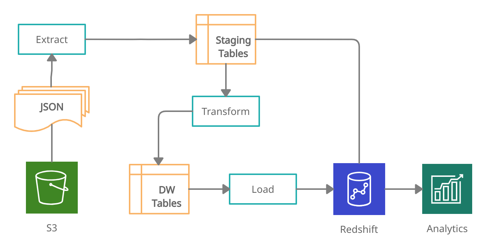

# AWS Redshift Data Warehouse
<br/>

>Author: Rodrigo de Alvarenga Mattos
>
>July 16, 2022
>
> [Udacity's Data Engineering Nanodegree](https://www.udacity.com/course/data-engineer-nanodegree--nd027)

<br/>

## Introduction
The objective of this project is to migrate from an on-premises PostgreSQL database to a managed solution using AWS Redshift cloud data warehouse. The raw data will be stored as JSON logs of user activity, extracted and transformed by the ETL pipeline, and then loaded into a set of dimensional tables. AWS Redshift was a good fit for the project requirements since it's easy to integrate with data lakes, databases, and machine learning tools providing superior performance and scalability to analytics applications and ad-hoc queries.

<br/>

## Project Dependencies

- [Python 3.10](https://www.python.org) 
- [Boto3 1.24.31](https://boto3.amazonaws.com)
- [Redshift Connector 2.0.908](https://docs.aws.amazon.com/redshift/latest/mgmt/python-driver-install.html)
- [Psycopg2 2.9.3](https://www.psycopg.org)
- [Pandas 1.4.3](https://pandas.pydata.org)
- [Terraform 1.2.3](https://www.terraform.io)
- [Sphinx 5.0.2](https://www.sphinx-doc.org)
  
<br/>

```python
# install project requirements
pip install -r requirements.txt
```

**NOTE**: Install all python libraries before running the ETL pipeline scripts and the jupyter notebooks.

<br/>

## Project Folder Structure

```
project
│   README.md
└───src
│   └───etl
│   |   │   create_tables.py
│   |   │   etl.py
|   |   |   sql_queries.py
|   |   |   dwh.cfg
|   |   |   ...
│   └───notebook
│       │   etl.ipynb
│       │   tests.ipynb
└───docs
    └───build
        └───html
            |   index.html
```

<br/>

## Auto-generate API Documentation

The [Sphinx](https://www.sphinx-doc.org) documentation generator was used to build the [HTML docs](https://htmlpreview.github.io/?https://github.com/rodrigoalvamat/datadiver-aws-data-warehouse/blob/main/docs/build/html/index.html) from the source code ```DOCSTRIGS```.

<br/>

## AWS Services and Resources

This is the list of services that have been provisioned in the AWS cloud:

| Service      | Resource                      | Description                              |
| ------------ | ----------------------------- | ---------------------------------------- |
| **IAM**      | Policy                        | Provides S3 Full Access.                 |
| **IAM**      | Role                          | Redshift service pricipal role.          |
| **IAM**      | User                          | Redshift user permissions statement.     |
| **S3**       | Udacity bucket                | Provided by the workspace environment.   |
| **VPC**      | Subnet Group and VPN Gateway  | Redshift virtual networking environment. |
| **VPC**      | Security Group                | Redshift inbound and outbound traffic.   |
| **Redshift** | Multi node cluster            | Cloud data warehouse.                    |

<br/>

## Terraform Infrastructure as a Code

We used Terraform to automate infrastructure provisioning, including servers, network, users, permissions, and security. Please follow the instructions below before running Terraform commands:

1. Edit the [terraform/secret.tfvars](./terraform//secret.tfvars) file according to your preferred settings:

```ini
redshift_database = "dwh"
redshift_user     = "dwhuser"
redshift_password = "xxxxxxxxxxxxxxxxxxxxxxxx"
```

2. Make sure you have the [AWS Command Line Interface](https://aws.amazon.com/cli) installed, the user is logged in and the default region is set:

```python
# check the current user
aws iam get-user

# the default region should be set
aws configure get region
```

3. Run Terraform commands:

```python
# set terraform folder as working directory
cd terraform

# prepare your working directory
terraform init

# create or update infrastructure
terraform apply -var-file="secret.tfvars"

# destroy previously-created infrastructure
terraform destroy -var-file="secret.tfvars"
```

## Database Schema Design

The database is modeled as a star schema that consists of a fact table (songplays) referencing four dimension tables (artists, songs, time, users).

All the SQL types and tables were defined in the [src/etl/sql_queries.py](./src/etl/sql_queries.py) file.

1. **Primary Keys** - All tables have their unique identifier column set as the primary key. 
 
2. **Distribution Style** - The fact table (songplays) and the dimension table (time) were defined with the distribution by key (distkey), since the frequency of joins between them tends to be high. Furthermore, both grow on the same scale. Finally, the rest of the tables were set to auto and Redshift chooses the appropriate distribution. [Choose the best distribution style](https://docs.aws.amazon.com/redshift/latest/dg/c_best-practices-best-dist-key.html).

3. **Sort Keys** - The fact table (songplays) and the dimension table (time) specify the join column as the sort key. On the other hand, the chosen criteria for the other tables was the column most frequently used to filter equality. [Choose the best sort key](https://docs.aws.amazon.com/redshift/latest/dg/c_best-practices-sort-key.html).

The figure below shows the database structure as an entity relationship diagram:

<div style='background-color:#fff;padding:24px;'>

</div>

<br/>

## Creating the Database Schema

The sample code below shows the main pipeline of the database creation process in the [src/etl/create_tables.py](./src/etl/create_tables.py) script:

```python
schema = SchemaPipeline(connection)
schema.drop()
schema.create()
```
<br/>

**IMPORTANT:** You should customize the [src/etl/dwh.cfg.template](./src/etl/dwh.cfg.template) configuration file according to your AWS environment and rename it to **dwh.cfg**.

**Run the command** below to create the database schema:

```bash
# change directory to src 
cd src

# to create the schema using the redshift connector
python -m etl.create_tables --redshift

# to create the schema using the pyscopg2 adapter (unstable behavior)
python -m etl.create_tables
```
<br/>


## ETL Pipeline

The ETL processes were developed in **two phases**. The first one implements the **Extract Phase** and uses the [COPY](https://docs.aws.amazon.com/redshift/latest/dg/r_COPY.html) command to transfer raw data from JSON files to the Redshift staging tables. The second one is the **Transform and Load Phase** and uses the [INSERT](https://docs.aws.amazon.com/redshift/latest/dg/r_INSERT_30.html) statement to load data into the star schema tables. Before insertion, the staging table's columns are joined, transformed, and cleaned by the nested [SELECT](https://docs.aws.amazon.com/redshift/latest/dg/r_SELECT_synopsis.html) statement.


The figure below shows the ETL Pipeline process diagram.

<div style='background-color:#fff;padding:24px;'>

</div>

<br/>

The sample code below shows the main ETL pipeline process in the [src/etl/etl.py](./src/etl/etl.py) script:

```python
pipeline = ETLPipeline(connection)
pipeline.load()
pipeline.insert()
```
<br/>

**IMPORTANT:** You should customize the [src/etl/dwh.cfg.template](./src/etl/dwh.cfg.template) configuration file according to your AWS environment and rename it to **dwh.cfg**.

**Run the command** below to execute the ETL pipeline:

```bash
# change directory to src 
cd src

# to run the pipeline using the redshift connector
python -m etl.etl --redshift

# to run the pipeline using the pyscopg2 adapter (unstable behavior)
python -m etl.etl
```
<br/>

## ETL Pipeline Jupyter Notebook

You can also run the ETL Pipeline using the [jupyter notebook](./src/notebook/etl.ipynb).

<br/>

## JSON Data Files Schema
<br/>

1. **Song Dataset** - The JSON files, located in the directory **s3://bucket/song_data**, are a subset of the [Million Song Dataset](http://millionsongdataset.com) and each file contains the following data schema:
   
```javascript
{
    "num_songs": 1,
    "artist_id": "ARD7TVE1187B99BFB1",
    "artist_latitude": null,
    "artist_longitude": null,
    "artist_location": "California - LA",
    "artist_name": "Casual",
    "song_id": "SOMZWCG12A8C13C480",
    "title": "I Didn't Mean To",
    "duration": 218.93179,
    "year": 0
}
```
<br/>

2. **Log Dataset** - The JSON files, located in the directory **s3://bucket/log_data**, were generated by an [event simulator](https://github.com/Interana/eventsim) according to the songs data from the previous dataset, and each file contains the following data schema:

```javascript
{
    "artist":"The Mars Volta",
    "auth":"Logged In",
    "firstName":"Kaylee",
    "gender":"F",
    "itemInSession":5,
    "lastName":"Summers",
    "length":380.42077,
    "level":"free",
    "location":"Phoenix-Mesa-Scottsdale, AZ",
    "method":"PUT",
    "page":"NextSong",
    "registration":1540344794796.0,
    "sessionId":139,
    "song":"Eriatarka",
    "status":200,
    "ts":1541106673796,
    "userAgent":"\"Mozilla\/5.0 (Windows NT 6.1; WOW64) AppleWebKit\/537.36 (KHTML, like Gecko) Chrome\/35.0.1916.153 Safari\/537.36\"",
    "userId":"8"
}
```
<br/>

## JSON Data Extract Pipeline

The figure below shows the ETL Pipeline's extract phase and the staging tables structure.

<div style='background-color:#fff;padding:24px;'>

</div>

<br/>

## Data Quality Checks

The [tests notebook](./src/notebook/tests.ipynb) defines a sequence of validation tasks that depends on running the ETL pipeline through the [ETL notebook](./src/notebook/etl.ipynb) first.

At the end of the ETL pipeline execution, a query will be executed for each table, and the result will be stored in a CSV file.

**NOTE**: Although it is not recommended to query all rows of a table, this decision was made because the service is is too expensive to keep the cluster running indefinitely, and the project tables were small.

Right after the ETL pipeline notebook, you can run the tests notebook to check the following:

| Action                            | Validation                                                         |
|-----------------------------------|--------------------------------------------------------------------|
| **Load all S3 log_data**          | Compares with the staging table, check row count and nulls         |   
| **Load the staging_events table** | Filter page = NextSong and apply a type check lambda function      |
| **Load S3 log_json_path**         | Check file content                                                 |
| **Load S3 song_data sample**      | Apply a type check lambda function                                 |
| **Load the staging_songs table**  | Join with staging_events to validate redshift's join by row count  |
| **Load each DW table CSV**        | Check data inserted into songplays, users, songs, artists and time |
| **Summary DataFrame**             | Compare the number of rows for each table with previous results    |

<br/>