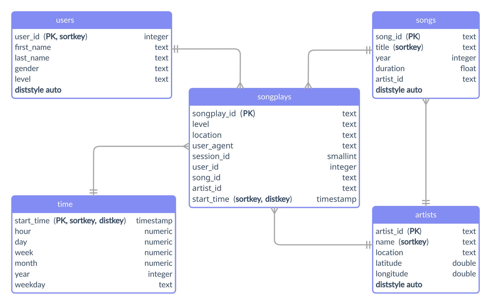
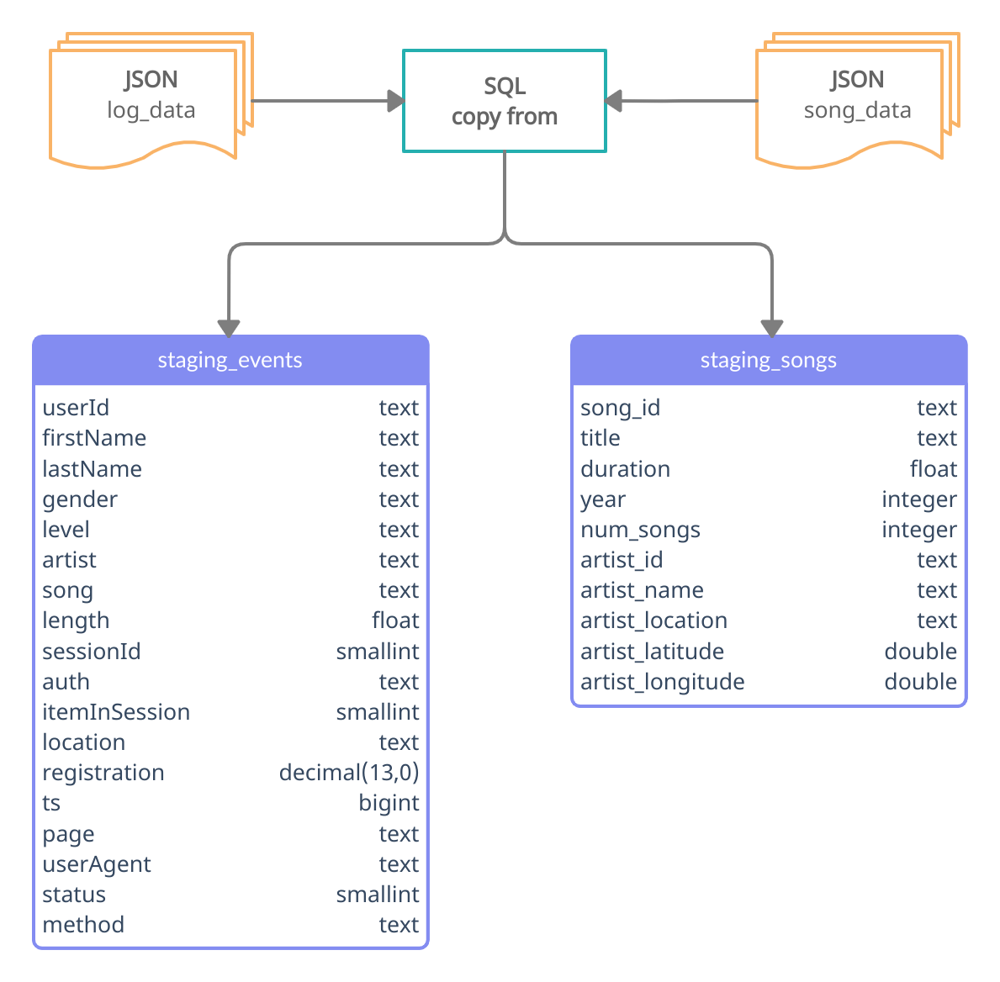

# AWS Redshift Data Warehouse
<br/>

>Author: Rodrigo de Alvarenga Mattos
>
>July 16, 2022
>
> [Udacity's Data Engineering Nanodegree](https://www.udacity.com/course/data-engineer-nanodegree--nd027)

<br/>

## Introduction
The objective of this project is to migrate from an on-premises PostgreSQL database to a managed solution using AWS Redshift cloud data warehouse. The raw data will be stored as JSON logs of user activity, extracted and transformed by the ETL pipeline, and then loaded into a set of dimensional tables. AWS Redshift was a good fit for the project requirements since it's easy to integrate with data lakes, databases, and machine learning tools providing superior performance and scalability to analytics applications and ad-hoc queries.

<br/>

## Project Dependencies

- [Python 3.10](https://www.python.org) 
- [Boto3 1.24.31](https://boto3.amazonaws.com)
- [Redshift Connector 2.0.908](https://docs.aws.amazon.com/redshift/latest/mgmt/python-driver-install.html)
- [Psycopg2 2.9.3](https://www.psycopg.org)
- [Pandas 1.4.3](https://pandas.pydata.org)
- [Terraform 1.2.3](https://www.terraform.io)
- [Sphinx 5.0.2](https://www.sphinx-doc.org)

<br/>

## AWS Services

This is the list of services that have been provisioned in the AWS cloud:

| Service      | Resource                      | Description                              |
| ------------ | ----------------------------- | ---------------------------------------- |
| **IAM**      | Policy                        | Provides S3 Full Access.                 |
| **IAM**      | Role                          | Redshift service pricipal role.          |
| **IAM**      | User                          | Redshift user permissions statement.     |
| **S3**       | Udacity bucket                | Provided by the workspace environment.   |
| **VPC**      | Subnet Group and VPN Gateway  | Redshift virtual networking environment. |
| **VPC**      | Security Group                | Redshift inbound and outbound traffic.   |
| **Redshift** | Multi node cluster            | Cloud data warehouse.                    |

<br/>

## Terraform Infrastructure as a Code

We used Terraform to automate infrastructure provisioning, including servers, network, users, permissions, and security. Please follow the instructions below before running Terraform commands:

1. Edit the [terraform/secret.tfvars](./terraform//secret.tfvars) file according to your preferred settings:

```ini
postgres_database = "dwh"
postgres_user     = "dwhuser"
postgres_password = "xxxxxxxxxxxxxxxxxxxxxxxx"

redshift_database = "dwh"
redshift_user     = "dwhuser"
redshift_password = "xxxxxxxxxxxxxxxxxxxxxxxx"
```

2. Make sure you have the [AWS Command Line Interface](https://aws.amazon.com/cli) installed, the user is logged in and the default region is set:

```python
# check the current user
aws iam get-user

# the default region should be set
aws configure get region
```

3. Run Terraform commands:

```python
# set terraform folder as working directory
cd terraform

# prepare your working directory
terraform init

# create or update infrastructure
terraform apply

# destroy previously-created infrastructure
terraform destroy
```   

## JSON Data Files Schema
<br/>

1. **Song Dataset** - The JSON files, located in the directory **s3://bucket/song_data**, are a subset of the [Million Song Dataset](http://millionsongdataset.com) and each file contains the following data schema:
   
```javascript
{
    "num_songs": 1,
    "artist_id": "ARD7TVE1187B99BFB1",
    "artist_latitude": null,
    "artist_longitude": null,
    "artist_location": "California - LA",
    "artist_name": "Casual",
    "song_id": "SOMZWCG12A8C13C480",
    "title": "I Didn't Mean To",
    "duration": 218.93179,
    "year": 0
}
```
<br/>

2. **Log Dataset** - The JSON files, located in the directory **s3://bucket/log_data**, were generated by an [event simulator](https://github.com/Interana/eventsim) according to the songs data from the previous dataset, and each file contains the following data schema:

```javascript
{
    "artist":"The Mars Volta",
    "auth":"Logged In",
    "firstName":"Kaylee",
    "gender":"F",
    "itemInSession":5,
    "lastName":"Summers",
    "length":380.42077,
    "level":"free",
    "location":"Phoenix-Mesa-Scottsdale, AZ",
    "method":"PUT",
    "page":"NextSong",
    "registration":1540344794796.0,
    "sessionId":139,
    "song":"Eriatarka",
    "status":200,
    "ts":1541106673796,
    "userAgent":"\"Mozilla\/5.0 (Windows NT 6.1; WOW64) AppleWebKit\/537.36 (KHTML, like Gecko) Chrome\/35.0.1916.153 Safari\/537.36\"",
    "userId":"8"
}
```
<br/>

## Fact and Dimensions Table Design

<div style='background-color:#fff;padding:24px;'>

</div>
<br/>

## Choose the Best Distribution Style

[AWS Guide](https://docs.aws.amazon.com/redshift/latest/dg/c_best-practices-best-dist-key.html)

## Raw Data Extraction Pipeline

<div style='background-color:#fff;padding:24px;'>

</div>
<br/>